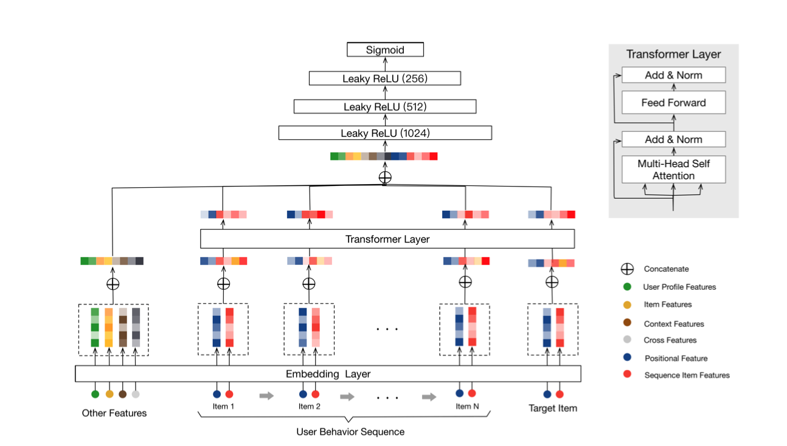

# Transformer-based Recommendation System

## Introducing Behavior Sequence Transformer (BST)

[Qiwei Chen et al.](https://arxiv.org/abs/1905.06874) implemented BST in their recommendation system, which resulted in Click-Through-Rate (CTR) outperforming results. 

Previous experiments in the area of recommendation systems (RS) were mainly based on the embedding raw features into low-dimensional vectors as input to MLP, which in turn provided final recommendations.  Those projects didn't take into consideration user behavior sequence, which the authors consider as crucial to improve prediction power of recommendation systems.

The authors suggest using Transformer from machine translation task in NLP, which could catch words dependency in sentences and also users' behavior sequences by using self-attention mechanism.  

Recommendation systems in Alibaba have two-steps pipeline: matching (finding similar candidate items based on user's selected items) and ranking (predicting probability of a user to click on candidate items).

The focus of this research paper is on ranking side, which is built on top of the wide and deep learning (WDL) network from Google.  The researchers define recommendation task as CTR prediction problem, where user's behavior is described as a sequence of items.  Based on this sequence, the task is to define function to predict probability of user's click on target item.

The architecture of the model is presented in the image below, taken from the research paper, and briefly described as following:

*   User behavior sequence, target item and other features (like user profile features, context features, item features, cross features) are embedded into low-dimensional vectors taken as input into the model.
*  Transformer layer is used to learn relations in the user behavior sequence.
*  Other features embedding is concatenated into transformer layer output.
*  The layers above are followed by 3 MLPs and sigmoid function to generate final predictions.

  

## References

1.   This experiment is based on the tutorial ["A Transformer-based recommendation system"](https://keras.io/examples/structured_data/movielens_recommendations_transformers/) by Khalid Salama;
2.   The Movielens dataset (1 Mio) is available at this [link](https://grouplens.org/datasets/movielens/1m/);
3.   Behavior Sequence Transformer (BTS) concept is described in the research paper ["Behavior Sequence Transformer for E-commerce Recommendation in Alibaba"](https://arxiv.org/abs/1905.06874) by Qiwei Chen, Huan Zhao, Wei Li, Pipei Huang, Wenwu Ou ;

  
 
